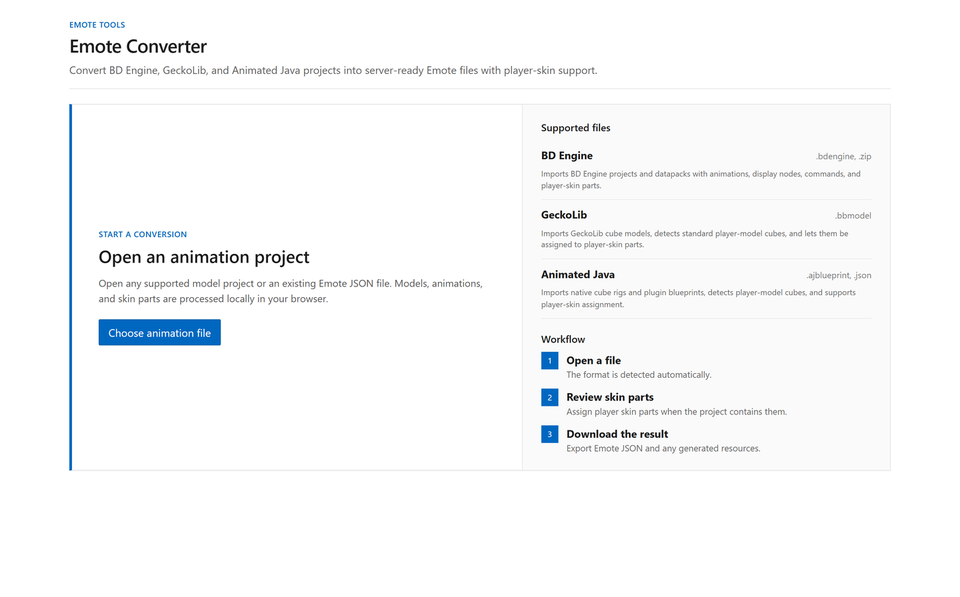
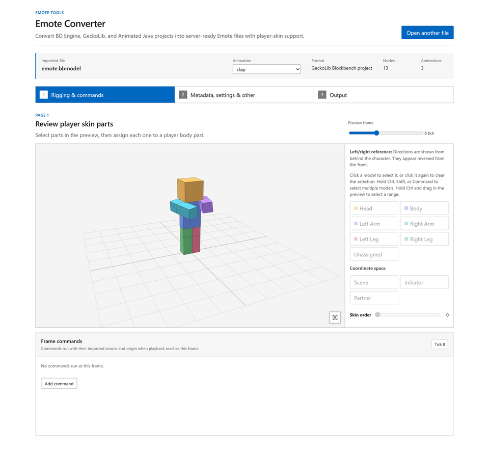
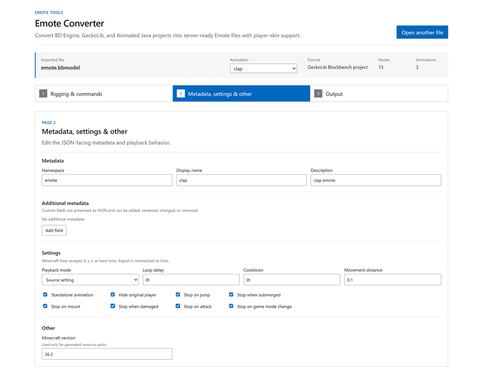

# Emote


> 애니메이션 사용을 허락해 주신 [Popular Vibe](https://block-display.com/bd/77774)에게 감사드립니다!

[](https://hanhy06.github.io/emote/)
[](https://modrinth.com/mod/emote)
[](https://github.com/hanhy06/emote)
[](https://discord.gg/CRWqKbSebW)

직접 만든 emote를 공유하고 싶다면 Discord 서버에 참여해 주세요.

## 주요 기능

Emote는 Minecraft display entity로 애니메이션을 재생하는 서버 사이드 emote 모드입니다. 서버에만 설치해도 모든 서버 기능이 동작하며, 선택적으로 클라이언트에 설치하면 emote wheel과 재생 중 자동 3인칭 전환이 추가됩니다.

웹 변환기는 BD Engine, GeckoLib, Animated Java를 지원합니다. Animation JSON을 직접 편집하지 않고 스킨 부위, metadata, 재생 설정과 command를 구성하고 resource pack까지 내보낼 수 있습니다.

서버에서는 LuckPerms의 permission을 사용해 플레이어별 emote와 idle emote를 구성할 수 있습니다. 여러 animation을 연결하는 sequence와 두 플레이어를 연결하는 2인 협동 emote를 지원하며, 호환되는 animation에는 각 플레이어의 스킨이 적용됩니다. 다른 모드에서 emote 등록, 재생 제어와 event를 사용할 수 있는 서버 API도 제공합니다.

## 명령어

### 플레이어

| 명령어 | 설명 |
|---|---|
| `/emote` | emote 메뉴를 엽니다. |
| `/emote <page>` | 지정한 메뉴 페이지를 엽니다. |
| `/emote search [query] [page]` | emote를 검색합니다. |
| `/emote play <id>` | ID로 emote를 재생합니다. |
| `/emote stop` | 현재 emote를 중단합니다. |
| `V` | 클라이언트 emote wheel을 엽니다. |

Wheel의 Order 버튼으로 항목을 추가, 제거하거나 정렬할 수 있습니다. 순서는 서버별로 클라이언트에 저장됩니다.

### 관리자

| 명령어 | 설명 |
|---|---|
| `/emote list` | 불러온 emote와 원본 정보를 표시합니다. |
| `/emote reload` | 설정과 animation을 다시 불러옵니다. |
| `/emote enable/disable <id>` | emote를 활성화하거나 비활성화합니다. |
| `/emote stop <player>`, `/emote stop-all` | 한 플레이어 또는 모든 emote를 중단합니다. |
| `/emote stress-test [count]` | 여러 emote를 재생해 서버 성능을 측정합니다. |

관리자 명령어는 `emote.manage` 권한을 사용하며 기본적으로 game master operator에게 허용됩니다.

## 서버 관리

```text
config/emote/
├── config.json
├── emotes.json
└── animations/
```

변환기에서 내보낸 JSON은 `animations` 아래에 넣습니다. 하위 디렉터리도 불러오며 파일명이 아니라 JSON의 `id`를 사용합니다. 잘못된 파일은 개별적으로 제외되고 중복 ID는 모두 거부됩니다.

### `config.json`

```json
{
  "schema_version": 1,
  "menu_page_size": 6,
  "mineskin_api_key": "",
  "mineskin_poll_interval_seconds": 3,
  "mineskin_cache_retention_days": 30,
  "mineskin_cache_max_mib": 256,
  "max_active_display_entities": 512
}
```

플레이어 스킨은 `mineskin_api_key`를 설정해야 적용됩니다.

### `emotes.json`

```json
{
  "schema_version": 2,
  "disabled": ["example:disabled"],
  "permissions": [
    {
      "permission": "emote.vip",
      "emotes": ["example:dance", "example:cry"],
      "idle": {
        "delay": "300s",
        "emote": ["example:dance", 70, "example:cry", 30]
      }
    },
    {
      "permission": "emote.default",
      "emotes": ["example:hello", "example:wave"]
    },
    {
      "permission": "emote.admin",
      "emotes": ["*"]
    }
  ]
}
```

`disabled`는 emote를 비활성화하고 `permissions`는 사용할 수 있는 emote와 idle emote를 정합니다. `emote.default`는 모든 플레이어에게 주어지며 `*`는 모든 활성 emote를 허용합니다. `emote.bypass`는 비활성화, 권한과 cooldown을 무시합니다.

## 웹 변환기

[Emote Converter](https://hanhy06.github.io/emote/)에서 animation JSON을 직접 편집하지 않고 프로젝트를 변환하고 설정할 수 있습니다. 모든 작업은 브라우저에서 처리됩니다.

3D preview에서 skin part와 coordinate space를 지정하고 metadata, 재생 방식, 중단 조건과 frame command를 설정할 수 있습니다. Animation JSON, sequence ZIP과 resource pack을 내보내거나 기존 resource pack에 병합할 수 있습니다.







### Animation 변환

웹 변환기는 원본 animation의 easing과 보간 곡선을 Minecraft tick에 맞게 다시 계산합니다. Bézier, Catmull-Rom, bounce와 elastic 같은 움직임의 중요한 지점을 보존하고 위치, 회전과 크기 오차가 가장 작은 keyframe 배치를 선택해 원본 움직임이 가능한 한 자연스럽게 유지되도록 변환합니다.

Animation마다 cooldown, player visibility, 이동, 점프, 공격과 피격 등의 중단 조건 및 frame command를 설정할 수 있습니다.

- [Animation format](./emote-animation-format.md)
- [Animation reference JSON](./emote-animation-format.json)

### Sequence

짧게 만든 animation clip들을 순서대로 연결하고 대기, 가중치 무작위 선택과 반복을 조합해 하나의 emote로 만들 수 있습니다.

```json
{
  "type": "sequence",
  "schema_version": 3,
  "id": "example:sit",
  "steps": [
    {"emote": "example:sit_down"},
    {"wait": "10t"},
    {
      "emote": [
        "example:sit_idle_1", 45,
        "example:sit_idle_2", 45,
        "emote:break", 10
      ],
      "repeat": 3
    },
    {"emote": "example:stand_up"}
  ]
}
```

- [Sequence format](./emote-sequence-format.md)
- [Sequence reference JSON](./emote-sequence-format.json)

### 협동 emote

Sequence에 두 플레이어의 animation을 결합해 함께 재생하는 협동 emote를 만들 수 있습니다. 가까이에서 서로 마주 보는 플레이어를 연결하고 성공 또는 timeout 연출을 실행하며, 대칭 동작은 상대 플레이어 쪽으로 자동 복제됩니다. `initiator`와 `partner`를 나누면 서로 다른 동작과 스킨을 사용하는 비대칭 연출도 만들 수 있습니다.

```json
{
  "type": "sequence",
  "schema_version": 3,
  "id": "emote:handshake",
  "participants": {
    "initiator": {"position": "~ ~ ~", "rotation": "~ 0"},
    "partner": {"position": "^ ^ ^1.2", "rotation": "~180 0"}
  },
  "steps": [{
    "await_partner": {"emote": "emote:handshake_offer", "timeout": "10s"},
    "matched": [
      {"emote": "emote:handshake", "repeat": 2},
      {"wait": "1s"},
      {"emote": "emote:handshake_close"}
    ],
    "timeout": [{"emote": "emote:handshake_close"}]
  }]
}
```

- [Two-player sequence reference JSON](./emote-two-player-sequence-format.json)

## Mod API

`EmoteApi.getInstance()`에서 재생 제어, runtime 등록, 상태 조회, 취소 가능한 play listener와 playback lifecycle listener를 사용할 수 있습니다. 상태 변경은 서버 thread에서 실행해야 하며 runtime 등록은 reload 이후에도 유지됩니다.

## 문제 해결

| 문제 | 확인할 내용 |
|---|---|
| Emote가 보이지 않음 | `/emote reload` 결과, 서버 로그, 중복 ID, `disabled`, sequence 전용 animation |
| 플레이어 스킨이 적용되지 않음 | 변환기의 skin part 지정과 `mineskin_api_key`를 확인합니다. 처음 사용하는 스킨은 준비 완료 후 다시 실행해야 하며, MineSkin을 사용할 수 없으면 기본 texture가 적용됩니다. |
| 플레이어 스킨이 이상하게 적용됨 | 웹 변환기에서 각 node의 skin part와 order를 다시 지정합니다. 2인 animation은 `initiator`와 `partner` coordinate space도 확인합니다. |

여기에서 해결되지 않으면 [Discord](https://discord.gg/CRWqKbSebW) 또는 [GitHub Issues](https://github.com/hanhy06/emote/issues)로 제보해 주세요.

## 라이선스

이 프로젝트는 [Apache License 2.0](../LICENSE)에 따라 배포됩니다.
