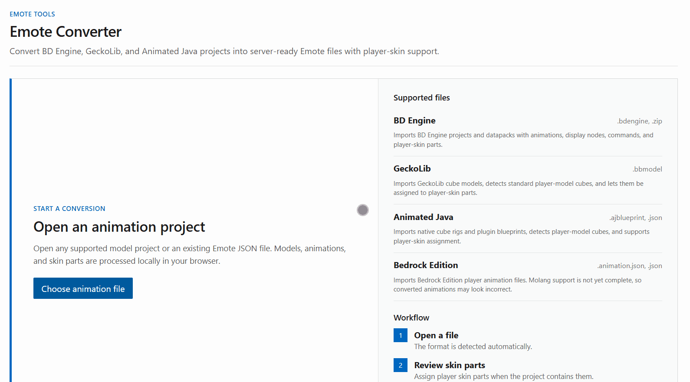
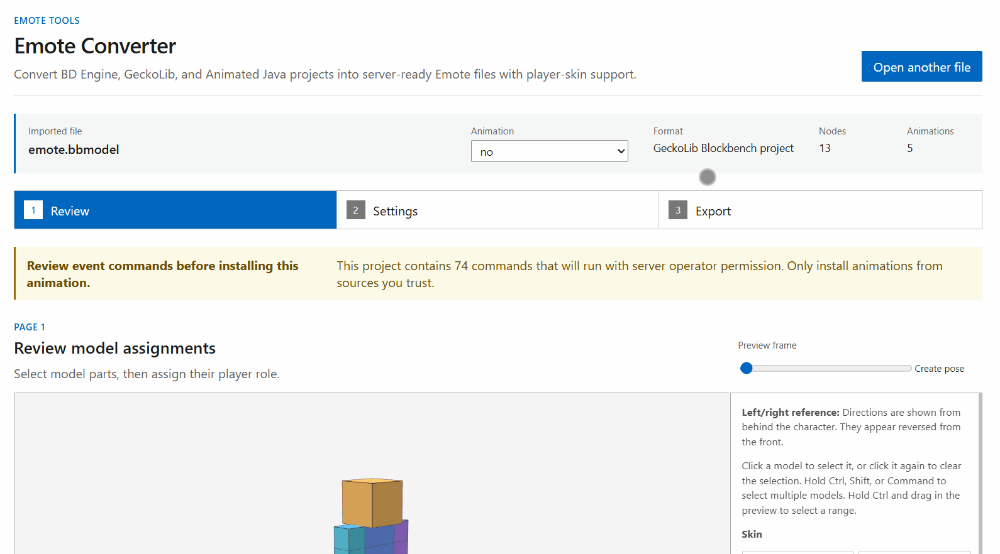
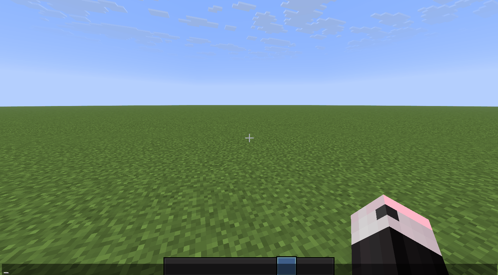

# Adding Custom Emotes

To use your own animation, convert the source project to Emote JSON with the [Emote Converter](https://hanhy06.github.io/emote/converter/), then install the exported files on the server. Conversion is performed locally in your browser.

## Supported formats

| Source format    | Files                         |
|------------------|-------------------------------|
| BD Engine        | `.zip`                        |
| GeckoLib         | `.bbmodel`                    |
| Animated Java    | `.ajblueprint`                |
| Bedrock Edition  | `.animation.json`, `.json`    |
| Emote            | Existing Emote Animation JSON |

## 1. Open a file

Select **Choose animation file** in the converter and open the source project. Its format and animations are detected automatically. If the project contains multiple animations, use the **Animation** menu at the top to select the animation you want to configure.



!!! warning "Use files from trusted sources"
    Event commands in the source file may run with server operator permission. Review any command warning shown after import, and install animations only from sources you trust.

## 2. Configure and export

In **Review**, select model parts and verify their player-skin assignments and coordinate spaces. You can reassign any parts that were detected incorrectly.

In **Settings**, configure the ID, name, description, and playback behavior. The ID must use the `namespace:path` format and must not duplicate another emote on the server.

When the configuration is complete, use **Export** to download the Animation JSON. To connect multiple animations as one emote, download every Animation JSON together with the Sequence file.



## 3. Install on the server

Place the exported JSON files under `config/emote/emote/`.

When an animation requires additional resources, the converter also downloads a `*.resources.zip` file. Place it under `config/emote/resource-pack/`; Emote adds its contents to the Polymer resource pack. Client delivery follows the shared Polymer configuration. See the [Polymer documentation](https://polymer.pb4.eu/latest/) for configuration details.

```text
config/emote/
├── emote/
└── resource-pack/
```

Run `/emote reload`, then use `/emote list` to confirm that the emote loaded successfully. To make it available to normal players, include its ID in a permission group in `emotes.json`. See [Access Control](access-control.md) for details.



If the emote does not load, check the `/emote reload` result and the server log. Invalid JSON, duplicate IDs, and missing Animations referenced by a Sequence each prevent the affected emote from loading.
